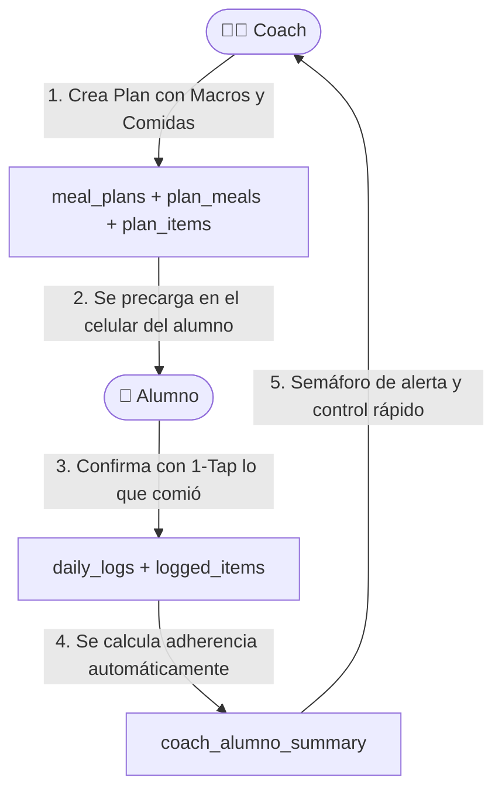

# 📚 Explicación de la Base de Datos y Nuevas Funcionalidades

Este documento reúne la explicación detallada de cómo está estructurada la base de datos en **Supabase**, qué hace cada tabla, cómo se conectan entre sí y cuál es el estado actual frente al frontend.

---

## 🧭 ¿Si pongo la app a correr en local ya tengo acceso a las nuevas features?

**Todavía no en la interfaz visual, pero la base de datos ya está 100% lista.**

Para entenderlo de forma simple:

1. **La Base de Datos (Supabase):** Ya tiene creadas todas las tablas nuevas, las reglas de seguridad (RLS), las relaciones entre Coach y Alumno, los planes de comida y el cálculo de adherencia.
2. **El Frontend (código visual en HTML/JS):** Actualmente el proyecto sigue con el código original (solo tiene el formulario de registro y la calculadora de calorías en local). Todavía **no está conectado** a estas tablas nuevas.

```
[ Frontend / Pantallas ]  -- (Falta conectar cables) -->  [ Base de Datos Supabase ]
   • index.html (registro)                                    ✅ profiles
   • alumno.html (calculadora estática)                       ✅ meal_plans
   • coach.html (diseño previo)                               ✅ plan_meals & plan_items
                                                              ✅ daily_logs & logged_items
                                                              ✅ coach_alumno_summary (Vista)
```

---

## 🏗️ ¿Qué hacen exactamente las tablas que se crearon?

Se diseñó la estructura pensando en el objetivo principal: **que el alumno no tenga que perder tiempo buscando cada alimento desde cero y que el coach pueda monitorear de forma semiautomática.**

---

### 1. `profiles` (Usuarios y Roles)
* **¿Qué hace?:** Extiende el sistema de autenticación de Supabase. Cada vez que alguien se registra, se guarda aquí si es un **`coach`** o un **`alumno`**.
* **El dato clave:** Si es alumno, tiene una columna `coach_id` que apunta directamente a su coach asignado. Esto vincula a ambos para siempre.

---

### 2. `meal_plans` (El Plan Nutricional General)
* **¿Qué hace?:** Es el plan o pauta que el Coach arma para su alumno.
* **Qué contiene:**
  * Metas diarias: Calorías totales, gramos de Proteínas, Carbohidratos y Grasas.
  * Esquema de porciones en formato JSONB flexible (para categorías como Proteínas, Frutas, Grasas, etc.).
  * Si está activo o archivado (`is_active`).

---

### 3. `plan_meals` (Las Comidas del Plan)
* **¿Qué hace?:** Divide el plan en los momentos del día.
* **Ejemplo:** Para el "Plan Definición", define:
  1. Desayuno (horario sugerido: 08:30)
  2. Almuerzo (horario sugerido: 13:00)
  3. Merienda (horario sugerido: 17:30)
  4. Cena (horario sugerido: 21:30)

---

### 4. `plan_items` (Los Alimentos Recetados / Sugeridos)
* **¿Qué hace?:** Son los ingredientes o platos específicos que el Coach cargó dentro de cada comida.
* **Ejemplo en el Desayuno:**
  * 3 Huevos (210 kcal)
  * 50g Avena (190 kcal)
  * 1 Manzana (80 kcal)
* **¿Por qué es clave?:** Al alumno **ya le aparecen cargados estos alimentos en su pantalla**. No tiene que buscar "huevo" en un buscador gigante estilo MyFitnessPal todos los días.

---

### 5. `daily_logs` (El Registro Diario del Alumno)
* **¿Qué hace?:** Representa el "día" del alumno (ej. `2026-09-19`).
* **Monitoreo semiautomático:**
  * Suma en tiempo real las calorías y macros consumidos vs. la meta del plan.
  * Guarda un porcentaje de adherencia (`adherence_pct`, ej: `92%`).
  * Estado del día: `completado`, `incompleto` o `desviado`.
  * Espacio para feedback o notas del Coach (`coach_feedback`).

---

### 6. `logged_items` (Lo que el Alumno Realmente Comió)
* **¿Qué hace?:** Guarda cada ítem que el alumno consumió en el día.
* **La magia del 1-Tap Check:**
  * Cada ítem tiene un campo `checked (true/false)`.
  * Como el plan ya le sugiere qué comer, el alumno solo entra y hace **"Click / Tap en ✔️"** al lado del alimento que ya comió.
  * Si cambió algo (ej. comió 80g de avena en vez de 50g), simplemente edita la cantidad. ¡Ahorra el 90% del trabajo manual!

---

### 7. `coach_alumno_summary` (Vista de Control para el Coach)
* **¿Qué hace?:** No es una tabla manual, es una **vista inteligente** que procesa los datos automáticamente para el panel del Coach.
* **Información que entrega de un vistazo:**
  * Lista de todos sus alumnos.
  * Último día que registraron comida.
  * Promedio de adherencia de los últimos 7 días.
  * Semáforo de alerta automático:
    * 🟢 **Excelente:** Adherencia > 85%
    * 🟡 **Aceptable:** Adherencia 70% - 85%
    * 🔴 **Bajo:** Adherencia < 70%
    * ⚫ **Inactivo:** Más de 3 días sin registrar nada.

---

## 🔄 El Flujo de Trabajo Completo



---

## 🔒 Seguridad (Row Level Security - RLS)
* Un alumno **únicamente puede ver y editar sus propios registros**.
* Un coach **puede ver sus datos y los de sus alumnos asignados**, pero nunca los alumnos de otro coach.
* Nadie sin autenticación puede leer o escribir información privada.
