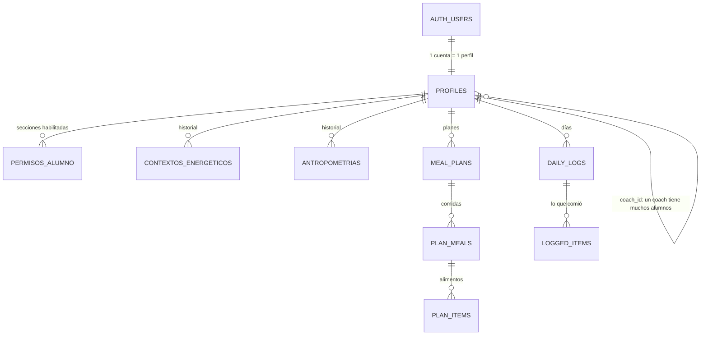

# Esquema de la base de datos

Cómo están organizados los datos de AppCalorias en Supabase: qué guarda cada
tabla, cómo se relacionan y quién puede ver o cargar cada cosa.
Para aplicar cambios, ver [README.md](README.md).

## Mapa general

| Tabla | Qué guarda | Estado |
|---|---|---|
| `profiles` | Cuenta: rol, @usuario, ID de cliente, coach, sexo, fecha de nacimiento. | En uso |
| `permisos_alumno` | Secciones que el coach le habilita al alumno. | Nueva, sin pantalla todavía |
| `contextos_energeticos` | Gasto energético y calorías objetivo (historial). | Nueva, sin pantalla todavía |
| `antropometrias` | Mediciones corporales y composición (historial). | Nueva, sin pantalla todavía |
| `meal_plans`, `plan_meals`, `plan_items` | Planes alimenticios. | Existen, sin conectar |
| `daily_logs`, `logged_items` | Registro diario del alumno. | Existen, sin conectar |
| `coach_alumno_summary` | Vista de resumen para el coach. | Existe, sin conectar |
| `alumnos` | Tabla vieja sin uso. Bloqueada. | Para borrar |

## Cuentas y vínculo (`profiles`)

Un perfil por cuenta de Supabase Auth. Lo crea un trigger al registrarse.

| Columna | Qué es | Quién la cambia |
|---|---|---|
| `role` | `alumno` o `coach`. | Nadie, después del registro. |
| `username` | @usuario, único, en minúsculas. | El propio usuario. |
| `client_code` | ID de cliente `NF-1234-AB`, solo alumnos. | Nadie (lo genera la base). |
| `coach_id` | Coach del alumno, o vacío. | `vincular_alumno` / `desvincular_alumno`. |
| `sexo`, `fecha_nacimiento` | Datos fijos para los cálculos. | El alumno o su coach, con `actualizar_datos_personales`. |
| `full_name`, `avatar_url` | Nombre y foto. Sin uso por ahora. | El propio usuario. |

## Datos cargados vs. resultados calculados

`contextos_energeticos` y `antropometrias` siguen la misma idea:

- **Cada carga es una fila nueva.** No se pisa la anterior: queda el historial
  para ver la evolución. La vigente es la más reciente.
- **Cada fila es una "foto" completa:** los datos que se cargaron **y** los
  resultados que calculó el frontend en JavaScript en ese momento.
- **La base no calcula.** Guarda lo que calculó JS. Si una fórmula cambia, las
  filas viejas siguen mostrando lo que se calculó entonces;
  `version_calculo` indica con qué versión de las fórmulas se hizo.
- **Las etiquetas Bajo / Normal / Alto no se guardan.** Las calcula JS al
  mostrar, comparando con la tabla de referencia.
- **`cargado_por`, `created_at` y `updated_at` los pone la base.** El
  navegador no los puede falsificar, ni cambiar de qué alumno es un registro.

### `contextos_energeticos`

| Grupo | Columnas |
|---|---|
| Datos cargados | `sexo`, `edad_anios`, `peso_kg`, `altura_cm`, `pasos_diarios`, `met`, `duracion_horas`, `sesiones_semana`, `tipo_dieta` |
| Solo si `tipo_dieta = 'personalizado'` | `peso_objetivo_kg`, `plazo_semanas` (obligatorios en ese caso) |
| Calculados en JS | `bmr_kcal`, `neat_kcal`, `gasto_sesion_kcal`, `entreno_diario_kcal`, `tdee_kcal`, `tdee_termogenesis_kcal`, `ajuste_kcal`, `calorias_objetivo` |

`tipo_dieta`: `deficit_leve`, `deficit_moderado`, `mantenimiento`,
`superavit_leve`, `superavit_moderado` o `personalizado`.

### `antropometrias`

| Grupo | Columnas |
|---|---|
| Datos generales | `fecha_medicion`, `sexo`, `edad_decimal`, `peso_kg`, `talla_cm` |
| 9 perímetros (cm) | `cuello_cm`, `torax_cm`, `brazo_relajado_cm`, `brazo_flexionado_cm`, `antebrazo_cm`, `cintura_cm`, `caderas_cm`, `muslo_medial_cm`, `pantorrilla_cm` |
| 8 pliegues (mm) | `pliegue_triceps_mm`, `pliegue_biceps_mm`, `pliegue_subescapular_mm`, `pliegue_cresta_iliaca_mm`, `pliegue_supraespinal_mm`, `pliegue_abdominal_mm`, `pliegue_muslo_mm`, `pliegue_pantorrilla_mm` |
| 3 diámetros (cm) | `diametro_muneca_cm`, `diametro_rodilla_cm`, `diametro_codo_cm` |
| Archivo | `pdf_path` (ruta en Supabase Storage, cuando se implemente) |
| Calculados en JS | `imc`, `indice_cintura_cadera`, `indice_cintura_talla`, `area_muscular_brazo_cm2`, `suma_8_pliegues_mm`, `grasa_pct`, `grasa_kg`, `masa_osea_kg`, `musculo_pct`, `musculo_kg`, `residual_pct`, `residual_kg`, `relacion_musculo_hueso` |

## Quién ve y quién carga

| | Ver | Cargar, editar, borrar |
|---|---|---|
| Alumno **sin** coach | Lo suyo | Todo lo suyo |
| Alumno **con** coach | Lo suyo | Solo las secciones habilitadas en `permisos_alumno` |
| Coach | Lo de sus alumnos vinculados | Todo lo de sus alumnos vinculados |
| Otro coach / sin sesión | Nada | Nada |

- **`permisos_alumno`:** una fila por sección habilitada (`contexto`,
  `antropometria`, `plan`). Solo el coach del alumno da o quita permisos.
- **Al vincular o desvincular:** los permisos del alumno se borran. Al
  desvincular, el coach deja de ver los datos, pero los registros quedan y el
  alumno vuelve a poder cargar todo.

Estas reglas están en las políticas RLS, usando las funciones
`puede_ver_alumno`, `puede_escribir_alumno` y `es_coach_de`. Valen aunque
alguien llame a la API sin pasar por la app.

## Funciones para el frontend

| Función | Para qué | Quién |
|---|---|---|
| `usuario_disponible(p_usuario)` | ¿El @usuario está libre? | Cualquiera |
| `vincular_alumno(p_codigo)` | Vincular un alumno por su ID de cliente. | Coach |
| `desvincular_alumno(p_alumno_id)` | Cortar el vínculo. | Coach del alumno o el alumno |
| `actualizar_datos_personales(p_alumno_id, p_sexo, p_fecha_nacimiento)` | Guardar sexo y fecha de nacimiento. | El alumno o su coach |

## Migraciones que arman este esquema

| Archivo | Qué agrega |
|---|---|
| `20261005120000_cuentas_y_vinculo.sql` | @usuario, ID de cliente, vínculo por código, cierre de accesos abiertos. |
| `20261006120000_contexto_y_antropometria.sql` | Sexo y fecha de nacimiento, `permisos_alumno`, `contextos_energeticos`, `antropometrias`. |

Las tablas de planes y registro diario son anteriores a estas migraciones y
todavía no tienen archivo en `migrations/`.
